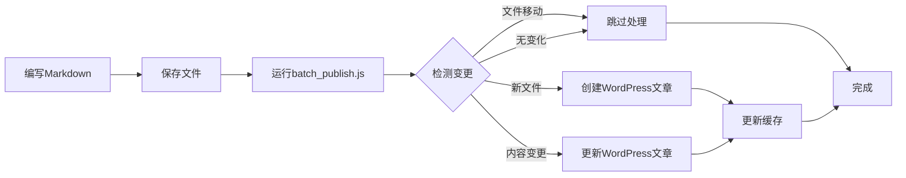

一个基于Node.js的高效WordPress文章发布系统，支持本地Markdown写作，自动检测变更，智能发布到WordPress网站。

## 🚀 核心特性

- **智能变更检测**：基于SHA1内容哈希，精确识别文章变更
- **文件移动容错**：支持文件夹重组，移动文件不会误判为新文章
- **增量发布**：只发布变更内容，避免重复操作
- **三重索引缓存**：文件路径、文章ID、内容哈希三重映射
- **批量&单文件**：支持批量处理和单文件精确发布
- **Windows优化**：针对Windows PowerShell环境优化


## 📁 项目结构

```
HaoyeBlog/
├── batch_publish.js     # 批量发布核心逻辑
├── publish.js          # 单文件发布&WordPress API封装
├── rebuild_cache.js    # 缓存重构工具
├── .publish-cache.json # 发布状态缓存
├── .env               # 环境配置（WordPress凭据）
├── package.json       # 项目依赖
└── posts/            # Markdown文章目录
    ├── 2024/
    ├── 2025/
    └── *.md
```

## 🛠️ 技术架构

### 核心技术栈
- **Node.js ES Modules**：现代化模块系统
- **WordPress REST API**：文章发布和更新
- **gray-matter**：Front Matter解析
- **crypto (SHA1)**：内容变更检测
- **文件系统监控**：递归目录扫描

### 架构设计思维

#### 1. 三重索引缓存系统
```javascript
{
  "files": {      // 按文件路径索引
    "path/to/file.md": { hash, id, slug, updatedAt, path }
  },
  "articles": {   // 按WordPress文章ID索引  
    "123": { hash, id, slug, updatedAt, path }
  },
  "hashes": {     // 按内容哈希索引
    "abc123...": { hash, id, slug, updatedAt, path }
  }
}
```

**设计理念**：
- 文件路径变化时，通过内容哈希找到原文章
- 防止文件移动造成重复发布
- 支持快速查找和状态同步

#### 2. 智能变更检测算法
```javascript
function needsPublish(filePath, content) {
  // 优先级检测：新文件 > 内容变更 > 文件移动 > 无变化
  if (!cache.files[filePath]) {
    if (existsInCache(contentHash)) return 'moved-file';
    return 'new-file';
  }
  if (cache.files[filePath].hash !== contentHash) {
    return 'content-changed';
  }
  return false; // 无需发布
}
```

**核心思维**：
- 基于内容而非路径判断变更
- 区分新建、更新、移动三种场景
- 最小化不必要的发布操作

#### 3. 错误隔离与容错机制
```javascript
// 单文件失败不影响批量处理
for (const file of toPublish) {
  try {
    await publishSingleFile(file);
  } catch (error) {
    console.log(`✗ 发布失败: ${error.message}`);
    // 继续处理下一个文件
  }
}
```

## 📝 使用方法

### 1. 环境配置

创建`.env`文件：
```env
WP_SITE_URL=https://your-wordpress-site.com
WP_USERNAME=your-username
WP_APP_PASSWORD=your-app-password
```

### 2. 文章格式要求

Markdown文件必须包含Front Matter：
```markdown
---
title: "文章标题"
slug: "article-slug"  # 必需，WordPress文章链接
date: "2025-09-21"
categories: ["分类名"]
tags: ["标签1", "标签2"]
---

文章正文内容...
```

### 3. 核心命令

```bash
# 批量发布所有变更文章
node batch_publish.js

# 发布单个文件
node publish.js "posts/2024/article.md"

# 重构缓存（统一格式）
node rebuild_cache.js
```

### 4. 工作流程



## 🎯 核心算法详解

### 变更检测逻辑
```javascript
function detectChangeType(filePath, content, frontMatter) {
  const contentHash = calculateHash(content);
  
  // 1. 检查是否为新文件
  if (!cache.files[filePath]) {
    // 通过内容哈希检查是否为移动的文件
    if (cache.hashes[contentHash]) {
      return { type: 'moved-file', record: cache.hashes[contentHash] };
    }
    return { type: 'new-file' };
  }
  
  // 2. 检查内容是否变更
  const cachedRecord = cache.files[filePath];
  if (cachedRecord.hash !== contentHash) {
    return { type: 'content-changed', record: cachedRecord };
  }
  
  // 3. 无变化
  return { type: 'unchanged', record: cachedRecord };
}
```

### 缓存同步策略
```javascript
function updateCache(filePath, record) {
  // 清理旧索引
  const oldRecord = cache.files[filePath];
  if (oldRecord) {
    delete cache.articles[oldRecord.id];
    delete cache.hashes[oldRecord.hash];
  }
  
  // 建立新索引
  cache.files[filePath] = record;
  cache.articles[record.id] = record;
  cache.hashes[record.hash] = record;
  
  // 持久化
  fs.writeFileSync(CACHE_FILE, JSON.stringify(cache, null, 2));
}
```

## 🔧 高级配置

### 自定义文件过滤
```javascript
// 在batch_publish.js中修改
const markdownFiles = allFiles.filter(file => {
  return file.endsWith('.md') && 
         !file.includes('draft') &&  // 排除草稿
         !file.includes('template'); // 排除模板
});
```

### 发布前自动校验
```javascript
// 验证Front Matter完整性
function validateFrontMatter(frontMatter) {
  const required = ['title', 'slug'];
  const missing = required.filter(field => !frontMatter[field]);
  if (missing.length > 0) {
    throw new Error(`Front Matter缺少必需字段: ${missing.join(', ')}`);
  }
}
```

## ⚠️ 注意事项

### 1. WordPress配置要求
- 启用REST API（WordPress 4.7+默认开启）
- 创建应用专用密码（推荐）或使用用户密码
- 确保用户有发布文章权限

### 2. 文件安全注意
- `.env`文件包含敏感信息，不要提交到Git
- 定期备份`.publish-cache.json`缓存文件
- 建议在测试环境先验证配置

### 3. 性能优化建议
- 大量文章时考虑分批处理
- 定期清理无效缓存记录
- 监控WordPress API响应时间

### 4. 错误排查指南

**常见问题及解决方案**：

```bash
# 1. 连接失败
Error: fetch failed
# 解决：检查.env配置和网络连接

# 2. 认证失败  
Error: 401 Unauthorized
# 解决：验证用户名和应用密码

# 3. 缓存不一致
# 解决：运行 node rebuild_cache.js

# 4. 文件路径问题（Windows）
# 解决：使用正斜杠路径 posts/article.md
```

## 🚀 性能特性

- **增量处理**：只处理变更文件，跳过未修改内容
- **智能缓存**：三重索引快速查找，O(1)复杂度
- **批量优化**：一次扫描所有文件，批量处理
- **错误隔离**：单文件失败不影响整体流程
- **内存友好**：流式处理大文件，不占用过多内存

## 📊 项目优势

### vs 传统WordPress后台编辑
- ✅ **离线编辑**：本地Markdown，版本控制友好
- ✅ **批量操作**：一次性处理多篇文章
- ✅ **格式一致**：Markdown标准，排版统一
- ✅ **备份简单**：文件系统天然备份

### vs GitHub Actions自动发布
- ✅ **即时响应**：本地执行，无需等待云端
- ✅ **网络要求低**：仅需WordPress API连接
- ✅ **调试便利**：本地调试，日志直观
- ✅ **高度可控**：完全自主的发布流程

## 🔮 扩展可能性

- **多站点支持**：同时发布到多个WordPress站点
- **图片自动上传**：集成图床服务，自动处理图片
- **SEO优化**：自动生成描述、关键词等元数据
- **定时发布**：结合cron实现定时发布功能
- **Web界面**：开发图形化管理界面

## 📄 许可证

MIT License - 自由使用、修改、分发

## 🤝 贡献

欢迎提交Issue和Pull Request，共同完善这个项目！

---

**设计理念**：简单、高效、可靠的本地到云端发布桥梁，让写作者专注于内容创作，而非技术细节。