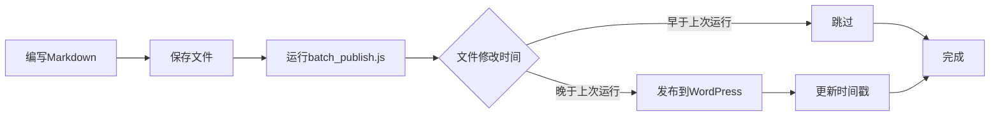

# HaoyeBlog - WordPress Markdown自动发布系统

一个基于Node.js的极简WordPress文章发布系统，支持本地Markdown写作，基于文件修改时间智能发布到WordPress网站。

## 🚀 核心特性

- **时间戳检测**：基于文件修改时间，只发布有变更的文章
- **零缓存维护**：无复杂缓存文件，仅记录上次运行时间
- **灵活时间范围**：支持指定天数、具体日期或默认增量发布
- **批量&单文件**：支持批量处理和单文件精确发布  
- **简单直观**：符合直觉的"上次运行后的变更"逻辑
- **Windows优化**：针对Windows PowerShell环境优化

## 📁 项目结构

```
HaoyeBlog/
├── batch_publish.js        # 简化版批量发布（基于时间戳）
├── publish.js             # 单文件发布&WordPress API封装
├── .last-publish-time     # 上次运行时间戳（简单文本）
├── .env                   # 环境配置（WordPress凭据）
├── package.json           # 项目依赖
└── posts/                # Markdown文章目录
    ├── 2024/
    ├── 2025/
    └── *.md
```

## 🛠️ 技术架构

### 核心技术栈
- **Node.js ES Modules**：现代化模块系统
- **WordPress REST API**：文章发布和更新
- **gray-matter**：Front Matter解析
- **文件系统时间戳**：基于mtime的变更检测

### 设计思维：极简主义

#### 时间戳方案优势
```javascript
// 极简的变更检测
const threshold = getLastRunTime();
const fileChangeTime = fs.statSync(file).mtime.getTime();
return fileChangeTime > threshold;
```

**核心理念**：
- 🎯 **直观易懂**：文件修改时间晚于上次运行 = 需要发布
- 🔧 **零维护**：只需一个时间戳文件，无复杂状态管理
- ⚡ **快速响应**：无需计算文件哈希，直接时间比较
- 🛡️ **容错性强**：删除时间戳文件即可重新开始

#### 使用场景适配
```bash
# 日常使用：只发布新的变更
node batch_publish.js

# 特定时间范围：发布最近N天的文章
node batch_publish.js --days=7

# 指定日期：发布某日期后的所有文章  
node batch_publish.js --since=2024-01-01

# 强制全部：重新发布所有文章
node batch_publish.js --all
```

## 📝 使用方法

### 1. 环境配置

创建`.env`文件：
```env
WP_SITE_URL=https://your-wordpress-site.com
WP_USERNAME=your-username
WP_APP_PASSWORD=your-app-password
```

### 2. 文章格式要求

Markdown文件必须包含Front Matter：
```markdown
---
title: "文章标题"
slug: "article-slug"  # 必需，WordPress文章链接
date: "2025-09-21"
categories: ["分类名"]
tags: ["标签1", "标签2"]
---

文章正文内容...
```

### 3. 核心命令

```bash
# 批量发布上次运行后的变更
node batch_publish.js

# 发布单个文件
node publish.js "posts/2024/article.md"

# 发布最近3天的变更
node batch_publish.js --days=3

# 发布指定日期后的变更
node batch_publish.js --since=2024-01-01

# 强制发布所有文件
node batch_publish.js --all

# 查看帮助
node batch_publish.js --help
```

### 4. 工作流程



## 🎯 核心算法详解

### 时间戳检测逻辑
```javascript
function needsPublish(filePath, threshold) {
  const stats = fs.statSync(filePath);
  const changeTime = Math.max(stats.mtime.getTime(), stats.birthtime.getTime());
  
  if (changeTime > threshold) {
    return {
      needed: true,
      changeDate: new Date(changeTime).toLocaleString(),
      reason: 'recently-modified'
    };
  }
  
  return { needed: false };
}
```

### 时间范围策略
```javascript
function determineTimeThreshold(opts) {
  if (opts.all) return 0;                    // 全部文件
  if (opts.days) return Date.now() - opts.days * 24 * 60 * 60 * 1000;
  if (opts.since) return new Date(opts.since).getTime();
  return getLastRunTime();                   // 默认：上次运行时间
}
```

## 🔧 高级配置

### 自定义文件过滤
```javascript
// 在batch_publish.js中修改
const markdownFiles = allFiles.filter(file => {
  return file.endsWith('.md') && 
         !file.includes('draft') &&  // 排除草稿
         !file.includes('template'); // 排除模板
});
```

### 时间戳管理
```javascript
// 手动重置（重新发布所有文件）
rm .last-publish-time

// 设置特定时间戳
echo "1640995200000" > .last-publish-time  # 2022-01-01

// 查看当前时间戳
type .last-publish-time
```

## ⚠️ 注意事项

### 1. WordPress配置要求
- 启用REST API（WordPress 4.7+默认开启）
- 创建应用专用密码（推荐）或使用用户密码
- 确保用户有发布文章权限

### 2. 时间戳注意事项
- `.last-publish-time` 文件包含上次成功运行的时间戳
- 发布失败时不会更新时间戳，下次运行会重试
- 删除时间戳文件会导致所有文件重新发布

### 3. 文件时间注意事项
- 基于文件系统的修改时间(`mtime`)和创建时间(`birthtime`)
- 文件复制、移动、`touch`命令会更新时间戳
- 系统时间调整可能影响检测准确性

### 4. 错误排查指南

**常见问题及解决方案**：

```bash
# 1. 连接失败
Error: fetch failed
# 解决：检查.env配置和网络连接

# 2. 认证失败  
Error: 401 Unauthorized
# 解决：验证用户名和应用密码

# 3. 时间戳异常
# 解决：删除 .last-publish-time 重新开始

# 4. 文件路径问题（Windows）
# 解决：使用正斜杠路径 posts/article.md
```

## 🚀 性能特性

- **快速检测**：直接文件时间比较，无需内容哈希计算
- **内存友好**：无缓存数据结构，内存占用极小  
- **批量优化**：一次扫描所有文件，批量处理
- **错误隔离**：单文件失败不影响整体流程
- **即时启动**：无缓存加载时间，即时响应

## 📊 项目优势

### vs 复杂缓存方案
- ✅ **极简架构**：一个时间戳文件 vs 复杂的JSON缓存
- ✅ **零维护**：无缓存同步、迁移、损坏等问题
- ✅ **直观理解**：时间概念 vs 哈希、索引概念
- ✅ **快速恢复**：删除时间戳即可重新开始

### vs 传统WordPress后台编辑
- ✅ **离线编辑**：本地Markdown，版本控制友好
- ✅ **批量操作**：一次性处理多篇文章
- ✅ **格式一致**：Markdown标准，排版统一
- ✅ **备份简单**：文件系统天然备份

### vs GitHub Actions自动发布
- ✅ **即时响应**：本地执行，无需等待云端
- ✅ **网络要求低**：仅需WordPress API连接
- ✅ **调试便利**：本地调试，日志直观
- ✅ **高度可控**：完全自主的发布流程

## 🔮 扩展可能性

- **定时任务**：结合cron实现定时检查发布
- **文件监控**：使用文件系统监控实时发布
- **多站点支持**：同时发布到多个WordPress站点
- **图片自动上传**：集成图床服务，自动处理图片
- **Web界面**：开发图形化管理界面

## 🤔 设计权衡

### 时间戳方案的局限性
- **误判可能**：文件复制、`touch`等操作会更新时间戳
- **系统依赖**：依赖文件系统时间的准确性
- **精度有限**：无法检测内容相同但时间戳不同的情况

### 适用场景
- ✅ **个人博客**：单人维护，误发布成本低
- ✅ **简单工作流**：写作→发布，流程直观
- ✅ **频繁更新**：日常写作，增量发布
- ❌ **企业级应用**：需要精确控制的场景
- ❌ **协作环境**：多人同时编辑的场景

## 📄 许可证

MIT License - 自由使用、修改、分发

## 🤝 贡献

欢迎提交Issue和Pull Request，共同完善这个项目！

---

**设计理念**：简单、直观、高效的本地到云端发布桥梁。让技术服务于写作，而非相反。